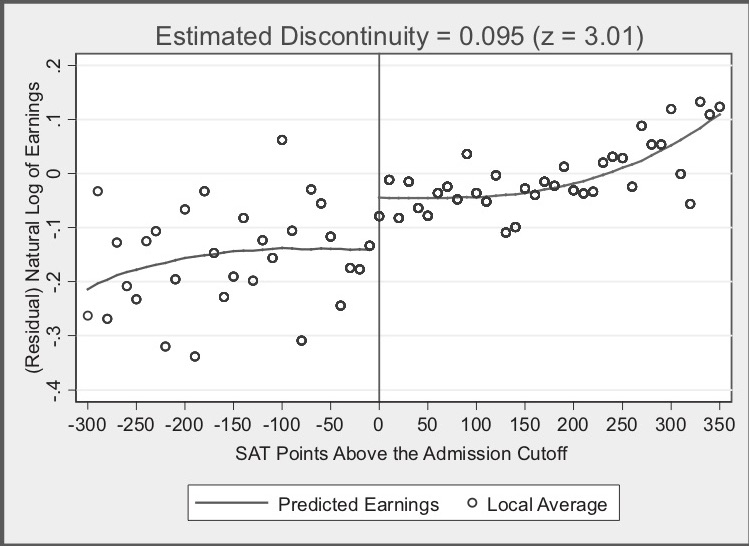

# Regression discontinuity (RD)

Regression Discontinuity Design (RDD) was first used by Thistlethwaite and Campbell (1960). It's appeal is that it can convinvingly **eliminate selection bias**.

It can be used when the **exposure status** (wholly or partly) is determined by some **continuous variable exceeding some arbitrary threshold**. [[Igelström et al. 2022]](https://doi.org/10.1136/jech-2022-219267) It works best when the cut-off is known, precise and free of manipulation - and is most effect when the exposure 'has a "hair trigger" that is not tightly related to the outcome being studied'. Examples:
* Arrest for DWI when > 0.08 blood-alcohol content
* Probably of receiving healthcare insurance at 65
* Probability of receiving medical attention jumping when birthweight falls below 1,500 grams
* Probability of attending summer school when grades fall below some minimum level [[Causal Inference: The Mixtape - Scott Cunningham]](https://mixtape.scunning.com/06-regression_discontinuity)

'If the **relationship between the forcing variable and the outcome is otherwise continuous, any discontinuity or jump in the relationship can be attributed to the exposure**.' RD estimates a local average treatment effect (LATE) 'among the individuals who fall **just above or just below the threshold**.' For this reason, we require **large datasets**.

'As with IV analysis, bias can occur if the forcing variable is connected to the outcome through a back-door path or any other pathway besides the exposure.' [[Igelström et al. 2022]](https://doi.org/10.1136/jech-2022-219267)

Why does this work? See below...

## How does RDD work?

To understand RDD, we first focus on **continuity**, which is a core assumption that is illustrated below.

In the **first graph** observe that:
* X (often called the "running variable" or "assignment variable" or "forcing variable") is a confounder (causes D and Y)
* As treatment assignment is based on cut-off, we can never observe units in both treatment and control with same value of X (does not satisfy overlap condition, can't meet backdoor criterion)

The **second graph** illustrates that:
* We can identify causal effects for subjects with **values of X close to the cut-off c<sub>0</sub>**. This is possible because the cut-off is the sole point where treatment and control subjects overlap.
* There are lots of assumptions in this graph
* One of the assumptions is **continuity**
  * This means X has no direct effect on Y
  * i.e. **At c<sub>0</sub>, X no longer has a direct effect on Y**
  * i.e. The cut-off c<sub>0</sub> **cannot be triggering a competing intervention** at the same time it triggers treatment D
  * i.e. Expected potential outcomes are continuous at the cut-off (which would necessarily rule out competing interventions occurring at the same time)
  * **The null hypothesis is continuity** (i.e. things changes gradually), and **any discontinuity implies some cause** ("nature does not make jump" - 'if you see a turtle on a fencepost, you know he didn’t get there by himself')

[[Causal Inference: The Mixtape - Scott Cunningham]](https://mixtape.scunning.com/06-regression_discontinuity)

````{mermaid}
  flowchart TD;

    graphb:::outline;
    subgraph graphb[" "]
      X2("<b>X near c<sub>0</sub></b>"):::white;
      D2("<b>D</b>"):::white;
      U2("<b>U</b>"):::white;
      Y2("<b>Y</b>"):::white;
    end

    X2 --> D2;
    D2 --> Y2;
    U2 --> Y2;

    grapha:::outline;
    subgraph grapha[" "]
      X1("<b>X</b> (continuous variable)"):::white;
      D1("<b>D</b> (treatment)<br><i>receive if X > cut-off c<sub>0</sub></i>"):::white;
      U1("<b>U</b>"):::white;
      Y1("<b>Y</b> (outcome)"):::white;
    end

    X1 --> D1;
    D1 --> Y1;
    X1 --> Y1;
    U1 --> Y1;
    X1 <-.-> U1;

    classDef white fill:#FFFFFF, stroke:#FFFFFF;
    classDef black fill:#FFFFFF, stroke:#000000;
    classDef outline fill:#FFFFFF;
````

An example of RDD is Hoekstra (2009)
* Aim: Estimate causal effect of college on earnings
* Problem: **Selection bias**. State flagship universities are more selective than public universities in the same state. State flagship schools have individuals with higher observed and unobserved ability, and due to their ability, expected them to earn more regardless of their university.

See first image from Hoekstra (2009), which is about admission to flagship college based on SAT points:
* Horizontal axis (SAT points above/below admission cut-off) is centred around 0 (cut-off). Cut-off was binding but not deterministic - some students below cut-off still get in - they likely had qualifications compensating for low SAT scores. Re-centred SAT scores are the running variable
* This is not individual data - it is binned, with each dot the conditional mean (enrollment rate)
* Lines are least squares fitted values of running variable, and regression could include higher-order terms, so line is above to more flexibly track central tendencies of data, with lines fit seperately for left and right
* There is a discontinuous jump at cut-off
* **Looking at a large sample of students just either side of the cut-off, we expect them to be pretty similar to one another in terms of observable and unobservable characteristics**.

[[Causal Inference: The Mixtape - Scott Cunningham]](https://mixtape.scunning.com/06-regression_discontinuity)


In this figure, notice:
* Estimated discontinuity 0.095 means that those just above cut-off earn 9.5% higher wages on average than those just below. With a variety of bins, estimates range from 7.4 to 11.1%.
* He has found that '**where workers experienced a jump in the probability of enrolling at the state flagship university, there is, ten to fifteen years later, a separate jump in logged earnings of around 10%**. Those individuals who just barely made it in to the state flagship university made around 10% more in long-term earnings than those individuals who just barely missed the cutoff.'
* 'Insofar as **the two groups of applicants right around the cutoff have comparable future earnings in a world where neither attended the state flagship university, then there is no selection bias confounding his comparison**'.

[[Causal Inference: The Mixtape - Scott Cunningham]](https://mixtape.scunning.com/06-regression_discontinuity)



## Sharp v.s. fuzzy RDD

**Sharp RDD** - when probability of treatment goes from 0 to 1 at cut-off - and so running variable is deterministic of X (dashed line)

**Fuzzy RDD** - when probability of treatment discontinuously increases at cut-off (as in example above) (solid line)


## Applying to our work

This might be less relevant for caesarean (no single one cut-off for a single treatment).

However, it would be relevant to stroke, which has much clearer cut-offs. Although maybe focus per hospital would you need to? If you think hospital has impact on threshold?
