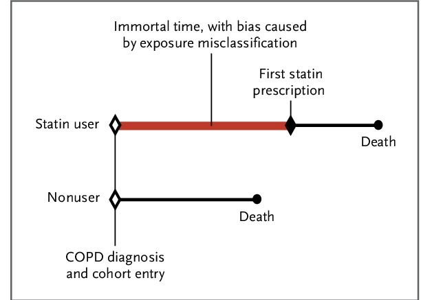
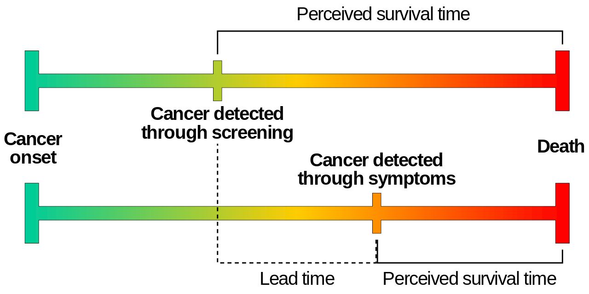
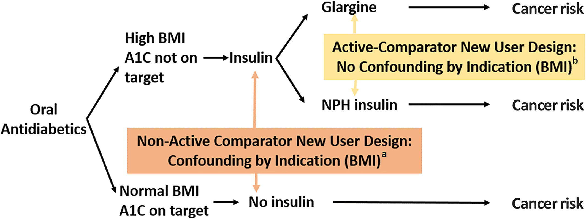
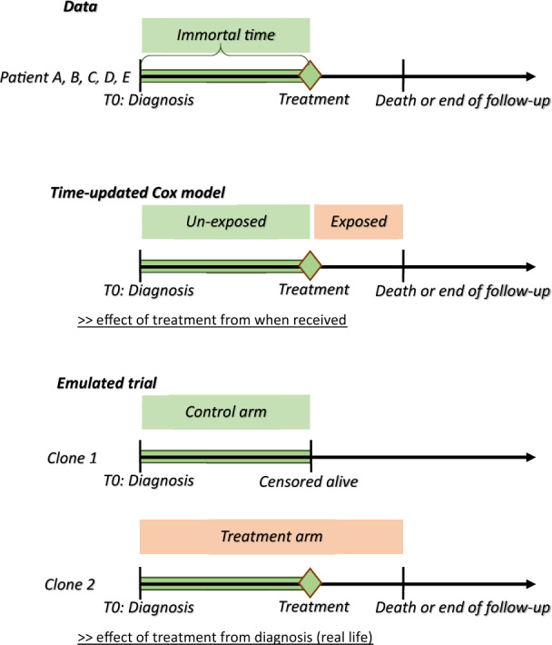

# Target trial emulation

`````{admonition} Executive summary
:class: info

**Target trial emulation** involves outlining your imaginary ideal RCT, and using that to inform study design, to help prevent avoidable biases like:
* **Immortal time bias** - when you ignore variation in timing of treatment initiation
* **Lead time bias** - when you detect a disease earlier than you otherwise would have in practice
* **Selection bias** - when people in study systematically differ from population of interest

It also helps identify relevant causal questions and confounders.

To design your target trial protocol you should outline the:
* Eligibility criteria
* Treatment strategies
* Treatment assignment
* Outcomes
* Causal estimand
* Start and end of follow-up
* Statistical analysis

When emulating the target trial, you should ensure that the following are aligned at **time zero**: eligibility criteria met, treatment strategies assigned, follow-up started.

There are several study designs that attempt to minimise bias in observational research. These include...

**Active comparator (AC), new user (NU) (ACNU)** design
* AC: Compares between two active treatment strategies, as no treatment can mean no indication for treatment (e.g. mild) or contraindications (e.g. severe co-existing conditions) - avoiding bias from contraindications
* NU: Follow from treatment initation, don't include current users

**Clone-censor-weight** design
* Clone (each patient starts on every treatment arm) and then censor (when no longer on arm) to reduce confounding at baseline and immortal-time bias
* This introduces informative censoring, which then adjust for by weighting (using inverse-probability weights)

**Sequential trial** design
* Series of artifical trials that divide at time points (e.g. study visits), and then within each trial, people are censored when their treatment deviates from what it was at the start of that artifical trial. Inverse probability weighting used to adjust for artifical censoring.
* Can then estimate effect of sustained treatment v.s. no treatment, starting at each time point
`````

## Introduction

'**Target trial emulation** is a **framework** for designing and analysing observational studies that aim to estimate the causal effect of interventions. For each causal question on an intervention, one can imagine the randomized trial (the “target trial”) that could have been conducted to answer that question. This target trial should be explicitly specified in a target trial protocol'. This then informs design of the observational study. [[Fu 2023]](https://doi.org/10.1681/ASN.0000000000000152)

Target trial emulation is recommended as the standard approach for causal observational studies that investigate interventions. Reasons for this include...

### Bias

It **improves the quality of these observational studies by preventing avoidable biases**. ' Although many practitioners worry about confounding in observational studies, the effect of these “self-inflicted” biases is often much more severe.' [[Fu 2023]](https://doi.org/10.1681/ASN.0000000000000152)

Examples:
* **Immortal time bias (ITB)** - 'occurs when there is variation in timing of treatment initiation from cohort entry and time-to-treatment is misclassified or ignored', meaning that a cohort is followed during times in which outcomes cannot occur. [[Agarwal et al. 2018]](https://doi.org/10.1177%2F1073274818789355) 

    Example from [Egom 2014](http://dx.doi.org/10.1056/NEJMc1408400#SA1):



* **Lead time bias** - 'when a disease is detected by a screening or surveillance test at an earlier time point than it would have been if it had been diagnosed by its clinical appearance' [[Rollinson and Sabel 2007]](https://doi.org/10.1016/B978-0-8151-4385-7.50009-6)

    Example by [Mcstrother - Own work, CC BY 3.0](https://commons.wikimedia.org/w/index.php?curid=15703636):



* **Selection bias** - 'occurs when individuals or groups in a study differ systematically from the population of interest leading to a systematic error in an association or outcome' [[Catalogue of Bias Collaboration]](https://catalogofbias.org/biases/selection-bias/)

A recent review of observational studies found that:
* 57% of observational studies suffer from immortal time bias
* 44% suffer from depletion of susceptibles/prevalent user selection bias.' [[Fu 2023]](https://doi.org/10.1681/ASN.0000000000000152)

### Relevant causal questions

Target trial emulation 'forces investigators to ask causal questions about interventions, leading to findings that are directly useful in decision-making'.

> Example: *'Many observational studies have investigated the causal effect of BMI on outcomes. BMI is not an intervention; patients cannot be randomized to have a certain BMI—a certain BMI can only be achieved through a particular intervention, such as diet, physical exercise, bariatric surgery, or medications (e.g., semaglutide or tirzepatide). These observational studies thus lose the vital information on how a patient attained a different BMI level. Each of the interventions may lower BMI by the same amount but may have completely different causal effects on the outcome. Therefore, the association between BMI and outcomes becomes an amalgamation of each of these interventions, which makes the association difficult to interpret.*'

'The fact that the causal effect of biomarkers cannot be directly studied does not necessarily mean that the target trial emulation is restrictive—the investigator just needs to reformulate the question in terms of an intervention, just as has been performed to research biomarker targets in real randomized trials.' [[Fu 2023]](https://doi.org/10.1681/ASN.0000000000000152)

### Identify confounders

> Example: *'Suppose that an investigator is interested in estimating the causal effect of living donor kidney transplantation versus deceased donor kidney transplantation on graft and recipient survival. Which confounders should the investigator adjust for: donor characteristics, recipient characteristics, or both?*
> 
> *When donor and recipient characteristics are imbalanced, the investigator may be inclined to adjust for both in the observational analysis. Fortunately, thinking about the target trial provides the solution. In a randomized trial, the investigator randomizes recipients to a kidney transplant from a living donor or a deceased donor. Consequently, the recipients in both groups have similar characteristics. However, living donors will not have characteristics similar to deceased donors in this randomized trial. The potential lower quality of kidneys from deceased donors is part of the treatment.*
> 
> *The observational analysis should therefore only adjust for recipient characteristics to emulate this randomization and not for donor characteristics.'* [[Fu 2023]](https://doi.org/10.1681/ASN.0000000000000152)

### Guides required data and analysis

'The required data and statistical analysis logically flow from the specifications in the research question.' [[Fu 2023]](https://doi.org/10.1681/ASN.0000000000000152)

## How to design your target trial protocol

You should include the following protocol elements. This table is adapted from [[Fu 2023]](https://doi.org/10.1681/ASN.0000000000000152). The example is 'for an observational study aiming to estimate the causal effect of renin-angiotensin system inhibitors versus calcium channel blockers on outcomes in patients with advanced CKD'.

| Protocol element | Description | Target Trial | Subsequent observational study | Comments |
| --- | --- | --- | --- | --- |
| **Eligibility criteria** | **Who will be included in this study?** | - Age 18+<br>- Under nephrologist care<br>- CKD G4 (i.e., eGFR <30 ml/min per 1.73 m2)<br>- No history of kidney transplantation<br>- No use of RASi or CCB in previous 180 d between January 2007 and December 2016 | Same as target trial | Observational study could be tempted to include all individuals on treatment or with outcome in follow-up - but this would be incorrect, as eligibility criteria determine who is enrolled in a trial, and information from follow-up could **never** determine eligibility<br><br>Will often need to **compromise** in observational study if can't get all data required to determine eligibility
| **Treatment strategies** | **Which precise treatment strategies or interventions will eligible individuals receive?** | 1. Initiate RASi (ACEi or ARB) only<br>2. Initiate CCB only | Same as target trial | In practice, more likely "initiate RASi only and always use during follow-up" - should capture that nauance. Important to be specific as guides follow-up and analysis, including whether need to adjust for time-varying confounding |
| **Treatment assignment** | **How will eligible individuals be assigned to the treatment strategies?** | Randomization, no blinding | Eligible individuals are assigned at baseline to the treatment strategy that their data are consistent with. To emulate randomization, we adjust for the following baseline confounders: age, sex, eGFR, systolic and diastolic blood pressure, medical history (heart failure, arrhythmia, peripheral vascular disease, cerebrovascular disease, ischemic heart disease, diabetes mellitus, hyperkalemia, AKI), medication use (β-blocker, thiazide diuretic, potassium-sparing diuretic, statin), and health care use (the total number of hospitalizations in previous year) | Individuals will be randomly assigned to one of the treatment strategies in the target trial<br><br>Appropriate emulation of randomization requires sufficient adjustment for all baseline confounders, which need to be measured before treatment assignment. The difficulty is to obtain enough data on confounders to remove residual confounding. |
| **Outcomes** | **What outcomes will be measured during follow-up?** | 1. Kidney replacement therapy (dialysis or kidney transplantation) 2. All-cause mortality 3. Major adverse cardiovascular events (composite of cardiovascular death, nonfatal myocardial infarction, nonfatal stroke) | Same as target trial. Kidney replacement therapy is registered in the Swedish renal registry; all-cause/cardiovascular mortality is identified from the Swedish death registry; hospitalizations for myocardial infarction or stroke are identified through ICD-10 codes in the national patient registry | Outcome data may often be missing<br><br>In observational data, outcomes usuallly not assessed blindly and systematically, so this can lead to bias (e.g. if you get more measurements when you're sicker - which you can addresss by comparing number of measurements - but not by restricting to patients with certain number of measurements, since randomised trial wouldn't have known that at baseline, and this would lead to selection bias) |
| **Causal estimand** | **Which causal estimand will be estimated with the observational data?** | **Intention-to-treat effect** (analyse in randomised groups regardless of whether complete or switch treatment)<br><br>**Per protocol effect** (only analyses people who strictly adhered to protocol - and excludes people who didn't complete or switched treatment) | Per protocol effect (effect of receiving treatment strategy as specified in protocol) | Randomised trials are commonly effect of being randomised (intention-to-treat effect) and effect of receiving treatment as per protocol (per protocol effect). Observational studies are not randomised so you can only estimate per protocol effects, **never** intention-to-treat (despire investigators often using that term) |
| **Start and end of follow-up** | **When does follow-up start and when does it end?** | Starts at randomization and ends at occurrence of end point, administrative censoring or 5 yr of follow-up | Starts at medication initiation (filled prescription) and ends at occurrence of end point, administrative censoring or 5 yr of follow-up | Target trial starts at randomization and finishes at reaching an end point, administrative censoring, or 5 years of follow-up<br><br>Observational starts when (1) patient eligible and (2) patient data congruent with start of treatment. There isn't clear time for when "do not initiate" treatment begins - solution is to analyse question in sequential trials, which uses idea that patients in "do not initiate treatment" group can be allocated to strategy at any point in time when are eligible. When interested in patients who "always use during follow-up", would need to censor (stop follow-up) when discontinue assigned treatment |
| **Statistical analysis** | **Which statistical analyses will be used to estimate the causal estimand?** | Intention-to-treat analysis, non-naïve per protocol analysis | Per protocol analysis: Hazard ratios are estimated using Cox regression while adjusting for baseline confounders with inverse probability of treatment weighting. Weighted cumulative incidence curves are estimated using the Aalen–Johansen estimatora | Includes methods to adjust for confounding, how missing data are dealt with, and which methods were used to obtain effect estimates |

[[Fu 2023]](https://doi.org/10.1681/ASN.0000000000000152)

## How to use this to inform your observational study

'To ensure that the target trial protocol properly emulates the design of a randomized trial, it is a key to align the following three components **at time zero** (often also referred to as baseline) in the observational study:
1. Eligibility criteria are met, that is, all included patients meet the specified inclusion and exclusion criteria.
2. Treatment strategies are assigned.
3. Follow-up is started, that is, we start counting outcomes.

Note that these three components are naturally aligned in randomized trials at the moment of randomization.' 

Observational study design options:
* Active comparator, new user (ACNU) design
* Clone censor weight design
* Sequential trial design [[Fu 2023]](https://doi.org/10.1681/ASN.0000000000000152)

### Active comparator, new user (ACNU) design

Used to compare effect of initiating two treatments [[Fu 2023]](https://doi.org/10.1681/ASN.0000000000000152)

Designed to 'emulate the intervention part of a RCT', comparing two cohorts of drug users.

* **Active comparator (AC)** design: restrict 'study to individuals with an indication for treatment and without contraindications' [[Lund et al. 2015]](https://doi.org/10.1007%2Fs40471-015-0053-5)
    * Compares with **active comparator** (another drug/treatment) rather than **non-active comparator** (no active treatment... non-users). Patients in that group - who have disease but are not on active treatment - can include those with no indication for treatment (e.g. mild disease), or people for whom all treatment is contraindicated (e.g. if have severe co-existing conditions) - and as such, are often not included in RCTs
    * Avoids **bias from contraindications**: In practice, 'physicians carefully choose who should or should not be treated with the drug of interest , causing imbalance between treatment groups in the baseline level of risk for the outcome of interest in observational studies—that is, confounding by indication'
    * 'The active-comparator design has three main advantages: increased similarity in measured patient characteristics between treatment groups; reduced potential for unmeasured confounding; and possibly improving the clinical relevance of the research question' [[Yoshida et al. 2015]](https://doi.org/10.1038/nrrheum.2015.30)
* **New user (NU)** design: align 'individuals at a uniform point in time to start follow-up (i.e., treatment initiation) and ensuring the correct temporality between covariate and exposure assessment' [[Lund et al. 2015]](https://doi.org/10.1007%2Fs40471-015-0053-5)
    * Also known as incident-user design or initator design
    * This 'includes a cohort of patients initiating treatment with a drug of interest who are followed up from treatment initiation, similar to RCTs. By contrast, the prevalent-user design includes both current and new users of a drug of interest within the study period, and follow-up thus starts at a different time point in the course of each individual's treatment'
    * 'The new-user design has three main advantages: time-varying hazards and drug effects associated with treatment duration can be assessed; appropriate adjustment for confounding is ensured by capturing pretreatment variables; and potential for immortal time bias is reduced when this design is combined with the active-comparator design' [[Yoshida et al. 2015]](https://doi.org/10.1038/nrrheum.2015.30)

Illustration of ACNU and confounding by indication from [Sendor and Stürmer 2022](https://doi.org/10.1002/pds.5407):


### Clone-censor-weight design

Useful for grace periods, treatment duration, or when treatment is started based on a biomarker level [[Fu 2023]](https://doi.org/10.1681/ASN.0000000000000152)

The approach involves three steps:
1. '**"Clone"** each patient once for each treatment regimen of interest.' [[source]](https://www.targetrwe.com/news-events/one-model-to-rule-them-all-using-a-single-model-to-control-for-confounding-and-informative-censoring/)
    * 'Cloning patients allows us to assign patients to both arms for the duration for which treatment allocation is unknown. At baseline, in our illustration, we assumed that all patients were equally likely to be offered surgery or not. As such, all patients entered both arms of the trial, independently of their subsequent surgery status. Thus, we created two clones of each patient with one clone allocated to each study arm, hence doubling the size of our dataset. The study arms are therefore identical with respect to demographics and clinical characteristics at the time of diagnosis. This removes confounding bias, at baseline only.' [[Maring et al. 2020]](https://doi.org/10.1093%2Fije%2Fdyaa057)
2. '**"Censor"** each clone when their person-time is no longer consistent with the corresponding treatment regimen.' [[source]](https://www.targetrwe.com/news-events/one-model-to-rule-them-all-using-a-single-model-to-control-for-confounding-and-informative-censoring/)
3. '**"Weight"** the remaining person-time by the inverse probability of being censored.' [[source]](https://www.targetrwe.com/news-events/one-model-to-rule-them-all-using-a-single-model-to-control-for-confounding-and-informative-censoring/)
    * 'If the decision to perform surgery was completely random or made based on patients’ characteristics that were not associated with the outcome, the artificial censoring done... would be ignorable, and would not bias the results. However, in most observational studies, treatment decision is based on characteristics also associated with the outcome, i.e. the confounders. In our example, the decision to perform surgery is associated with age, performance status and comorbidity index, which are also associated with survival. In such situations, the artificial censoring introduces selection bias... The proposed approach to address this problem is to use inverse-probability-of-censoring weighting (IPCW)' [[Maring et al. 2020]](https://doi.org/10.1093%2Fije%2Fdyaa057)

Explanation of how this addresses bias: 'When the start of follow-up and the time of treatment initiation do not coincide i.e. when the exposure (or treatment) status is not defined at the inclusion within the study, immortal-time bias is a concern if the study groups are defined based on the observed treatment allocation. Indeed, treatment receipt at a given time t is conditional on having survived up to time t, and consequently, treatment receipt is more likely to be observed among patients with longer survival. We illustrated how cloning patients at the start of follow-up, carefully defining the survival time and vital status for each clone, and choosing the length of the grace period, as proposed by Hernàn et al.,9,10 can address both confounding and immortal-time biases. However, by cloning and censoring the patients to account for confounding at baseline and immortal-time bias, we introduce an informative censoring, which does not exist in the original dataset. This artificial censoring can be adjusted for by inverse-probability weights in the statistical analysis, which is the main complexity of this approach' [[Maring et al. 2020]](https://doi.org/10.1093%2Fije%2Fdyaa057)

Illustration of design from [Maring et al. 2020](https://doi.org/10.1093%2Fije%2Fdyaa057):



### Sequential trial design

Appropriate when one group starts with treatment and other does not [[Fu 2023]](https://doi.org/10.1681/ASN.0000000000000152)

This design was first described by Hernan et al. in 2008 and Gran et al. in 2010. It 'was originally proposed as a simple way of making efficient use of longitudinal observational data, as it enables use of a larger sample size than if an artificial trial were formed from a single time origin'. However, it is also an approach that can be used as an alternative to inverse probability weighted estimation of marginal structural models (MSM-IPTW)

In this design:
* Artifical "trials" are created from a sequence of new time origins (e.g. 'study visits at which new information recorded for each individual who remains under observation').
* 'At each time origin individuals are divided into those who have just initiated the treatment under investigation and those who have not yet initiated the treatment.'
* 'Within each trial, individuals are artificially censored at the time at which their treatment status deviates from what it was at the time origin, if such deviation occurs.'
* 'Inverse probability of censoring weighting is used to account for dependence of this artificial censoring on time-dependent characteristics'
* ' The overall effects of sustained treatment versus no treatment, starting from each time origin, can then be estimated using, for example, weighted pooled logistic or Cox regression' [[Keogh 2023]](https://doi.org/10.1002%2Fsim.9718)