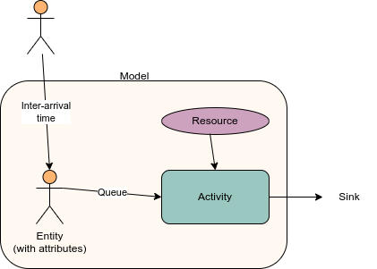

# Discrete event simulation (DES)

## What is DES?

A DES models the behaviour of a system as a sequence of events in time. [[source]](https://www.quora.com/What-is-the-difference-between-Monte-Carlo-and-discrete-event-simulation) It is used to model queueing problems (e.g. people waiting for service/s). [[source]](https://hsma-programme.github.io/hsma6_des_book/intro_to_des_concepts.html) It is:
* **Stochastic (probablistic)** - use random variables as inputs. Also known as probablistic models. Incorporate randomness/information about uncertainty. [[source]](https://www.preventionweb.net/understanding-disaster-risk/key-concepts/deterministic-probabilistic-risk)
* **Dynamic** - represents changes in system over time
* **Discrete** - variables change at discrete points in time (e.g. customer arrivals) [[source]](https://bookdown.org/manuele_leonelli/SimBook/types-of-simulations.html)

The output of a stochastic model is a **distribution** so stochastic healthcare systems have variable performance. Model is a simplification of the system that attempts to mimic that variation. If we want to compare two or more systems that have stochastic behaviour and output a random variable, then we must do so carefully as there is a risk of making an inference error.[TomL7]

It uses **next event time handling**, meaning it keeps track of when events are due and hopes from event to event. This is more efficient, as ignores time inbetween when nothing is happening.[TomL7]

## Components of a DES

You can have a single **run** of a model, or you can have a batch of runs with the same parameter values which is a **trial**.

You model has **entities** (e.g. patients, ambulances, hospitals). The frequency at which they are generated can be determined by the **inter-arrival time**.

Entities wait in **queues** for **activities**. The queue will have a queueing policy which determines the order that entities are released (commonly first in first out, or priority-based). How long the activity then takes is the **activity time**. We also know the **resources** required for an activity to happen (specifically, the type and number of resources).

**Sinks** are how entities leave the model - which happens when they are outside of the model scope.

Entities can have **attributes** that determine their journey (e.g. which path, queue priority, activity length). [[source]](https://hsma-programme.github.io/hsma6_des_book/intro_to_des_concepts.html)

Diagram created used [https://app.diagrams.net/](https://app.diagrams.net/):

You can have **branching paths** (so different entities flow to different activities and/or sinks), which might be due to attributes, or probability, or time.

You will monitor **outputs** that answer your modelling questions - often this is a description of time that entities are in the system, queue length and duration, resource utilisation, probability of exceeding a threshold. [[source]](https://hsma-programme.github.io/hsma6_des_book/intro_to_des_concepts.html)

## DES Inputs

You use **input modelling** to determine the appropriate inputs for your model. This has four stages:
1. **Data collection.**
2. **Identifying the input data distribution.** (e.g. review data histogram, think about context/intended use of data, consider whether there is correlation/dependency which may mean you need ‘more complex distributions that can represent autocorrelative processes, time-series data, or multivariate inputs’, whether the process changes over time, and the range of the data)
3. **Estimating parameters for the selected distribution.** (e.g. normal distribution needs mean and variance/standard deviation, bernoulli distribution needs probability of success/failure in a binary experiment). Commonly use maximum likelihood estimation (MLE) or least-squares estimation
4. **Estimating the goodness of fit.** Estimates ‘closeness between real data and samples that the selected probability distribution produces’ (e.g. Kolmogorov-Smirnov test) [[source]](https://softwaresim.com/blog/input-modeling-as-a-foundation-for-simulation/)

## DES Outputs

A simulation like DES can be either:
* **Terminating** - starts empty and finishes empty (e.g. day surgery)
* **Non-terminating** - no natural endpoint (e.g. emergency department) [TomL10]

There are four possible output types from these models:
* **Transient** output - distribution of output is constantly changing
* **Steady state** - output is consistent - it varies but within a fixed distribution (steady-state distribution)
* **Steady-state cycle** - outputs shifts from one steady-state to another in a regular pattern (e.g. call volume differs by time of day, but will be in a steady-state if comparing the same time of day across multiple days)
* **Shifting steady-state** - output shifts from one steady-state to another without a regular/predictable pattern

**Terminating** models typically have **transient** output. **Non-terminating** models typically have a **steady-state** output (possibly with a cycle or shifts). It is possible however for a terminating model to have a steady state output (particularly if have long run length before terminates), and for a non-terminating model to not reach steady state. [[source]](https://books.google.co.uk/books?id=Dtn0oAEACAAJ)

## Initialisation bias

Data collection should have a **realistic starting point**. Our problem is that models have **initialisation bias** - i.e. they start in an unrealistic state. To deal with this...

### Method 1. Inspect time series

A **warm-up period** is when you run the model like normal, but don't collect the results. [[source]](https://hsma-programme.github.io/hsma6_des_book/model_warm_up.html)

To find the length of the warm-up period, you should run the simulation for a long time, inspect a metric (e.g. waiting time every 60 minutes), and look for when it enters steady state. You would then delete that portion of the simulation (i.e. don't save results until past the time threshold).[TomL10]

To identify when you have reached the steady state, you can either:
* **Use statistical method** to determine when equilibrium is reached - [example](https://eudl.eu/pdf/10.4108/ICST.SIMUTOOLS2009.5603)
* Eyeball it
* Run it for a long time [[source]](https://hsma-programme.github.io/hsma6_des_book/model_warm_up.html)

### Method 2. Set initial conditions manually

This save run time as you normally run and then delete warmup. This can either be based on:
* **Real system**
* Running the **model** with warm-up and observing the steady state conditions

You could consider using a **distribution** of initial conditions.

## Queue characteristics

'The **queue discipline** indicates the order in which members of the queue are selected for service'.[[source]](https://www.oreilly.com/library/view/quantitative-techniques-theory/9789332512085/xhtml/ch9sec9.xhtml)

Discplines:
* **FIFO (first-in first-out)** - a.k.a. FCFS (first-come first served)
* **LIFO (last-in first-out)** - last entity is served first (e.g. eating a stack of pancakes)[[source]](https://people.revoledu.com/kardi/tutorial/Queuing/Queuing-Discipline.html)
* **SIRO (service in random order)** - i.e. randomly
* **Priority queue** when certain entities get priority [[source]](https://www.oreilly.com/library/view/quantitative-techniques-theory/9789332512085/xhtml/ch9sec9.xhtml)

There are then certain behaviours we might observe...

**Reneging** - Entity removes themself from a queue after a certain amount of time has elapsed
* E.g. Patient attribute of patience (e.g. sample a number, and thats how many minutes they are prepared to wait), when request resource tell simpy to wait until request is met or the patients patience expires. If they reneged, they won’t see nurse and we record the number that reneged

**Balking** - Entity chooses not to enter a queue in the first place because (a) it is too long for their preferences, or (b) there is no capacity for them
* Example for (b): Have parameter in g class with maximum queue length allowed. Have model attribute storing patients in queue, updated whenever patient leaves or joins. Before ask for nurse resource, check if queue is at max size. If so, patient will never join queue and we record that.

**Jockeying** - Entity switches queues in the hope of reducing queue time
* Never used in healthcare system. However, you might have system where entities pick which queue to join in the first place based on queue length (e.g. choosing between MIU or ED based on live waiting time data online) [[source]](https://hsma-programme.github.io/hsma6_des_book/reneging_balking_jockeying.html)

## Packages and software for discrete event simulation

Python packages:
* **SimPy**
* **CIW** - [docs](https://ciw.readthedocs.io/en/latest/), [example](https://github.com/TomMonks/ciw-urgent-care-call-centre), [conversion from SimPy](https://health-data-science-or.github.io/simpy-streamlit-tutorial/content/03_streamlit/13_ciw_backend.html)
* **Salabim** - [docs](https://www.salabim.org/manual/Overview.html), provides methods for 2D and 3D animation

R packages:
* **simmerR** - [docs](https://r-simmer.org/), [conversion from SimPy](https://r-simmer.org/articles/simmer-05-simpy), [tutorial](https://the-strategy-unit.github.io/des_simmer_workshop/), can plot flow diagram of steps in model

FOSS GUI software (i.e. drag and drop):
* **JaamSim** [[source]](https://hsma-programme.github.io/hsma6_des_book/alternative_foss_simulation_libraries_software.html)

Non-FOSS GUI:
* Simul8

## Examples

* [Streamlit app with key DES concepts](https://hsma-programme.github.io/Teaching_DES_Concepts_Streamlit/ )
* [SimPy examples](https://github.com/stars/Bergam0t/lists/simpy-examples)
* [Visualisation examples](https://github.com/Bergam0t/simpy_visualisation ) [[source]](https://hsma-programme.github.io/hsma6_des_book/further_reading.html)